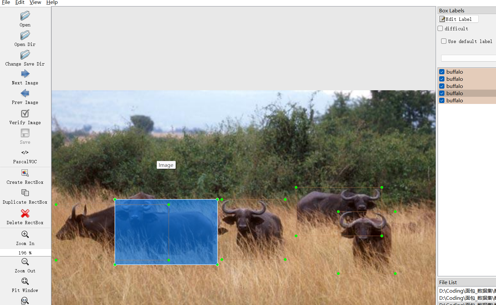

# Wildlife Detection - Target Detection Dataset

Dataset Information Introduction: A total of 1504 images and corresponding annotation files are available. The annotation file formats include both the VOC format's XML files and the YOLO format's txt files.

The following are the types of objects annotated:
- Buffalo
- Rhino
- Elephant
- Zebra

The number of annotated bounding box information is as follows: (Annotations are usually labeled in English, but Chinese for the reference inside parentheses)
- Buffalo: 554 (Buffalo)
- Rhino: 559 (Rhino)
- Elephant: 748 (Elephant)
- Zebra: 824 (Zebra)

Note: An image may contain multiple objects, so the total count of annotated bounding boxes might be greater than the number of images.

The complete dataset consists of three folders and one txt file:
- all_images file: Stores the dataset's images, screenshots included:
- Image size information:
- all_txt folder and classes.txt: Stores the YOLO format's txt annotation files, the number matches the number of images, each annotation file corresponds to a single image.
- classes.txt:
- For a detailed understanding of the standard YOLO format, please search for it on your own by searching "YOLO". In short, the index 0 in the array represents the name of the object at position 0 in the array in the classes.txt file.
- all_xml file: The VOC format's XML annotation file.
- Numbers match those of the images, each annotation file corresponds to a single image.
- For a detailed understanding of the VOC format's standard file, please search for it on your own by searching "VOC".
- Both formats are usable; choose one based on your preference.

Annotation effect screenshots:
## Images

Here is a pay link on Stripe ( https://buy.stripe.com/3cs8yP7sY87d0vu9AB ). Please contact me lonlonago@foxmail.com after funding $89, and I will send you a complete data files , thank you!

